# agent-eval-harness

[](https://github.com/muhib-karim/agent-eval-harness/actions/workflows/ci.yml)


[](https://github.com/muhib-karim/agent-eval-harness/releases)
[](https://muhib-karim.github.io/agent-eval-harness/)

A CLI and Python library for comparing coding models and coding-agent commands on the same
tasks. Each attempt writes a Python module. The harness then grades it against pytest files the
model never saw, and keeps the evidence: raw output, generated source, test log, and a JSONL
record.

**Live demo:** [the HTML report from the offline demo](https://muhib-karim.github.io/agent-eval-harness/),
rebuilt by CI from `main` on every push (raw [results.jsonl](https://muhib-karim.github.io/agent-eval-harness/results.jsonl)).

## Problem

Comparing models by reading a few of their answers gives results you can't reproduce, and
people tend to believe the answer that looks most convincing. Evaluation scripts written in a
hurry add other problems: tests left in the agent's workspace, a single sample reported as
"pass@k", and missing token counts shown as zero. This project handles those cases explicitly.
Tests are copied in only after generation. Pass@k uses the unbiased estimator over repeated
attempts. Usage and cost stay `unknown` unless the endpoint reports them.

## Architecture

```mermaid
flowchart LR
    Config[run config + task.yaml files] --> Engine
    Engine -->|one job per model × task × repeat| Runner[Runner<br/>openai / anthropic / cli / mock]
    Runner -->|writes entrypoint| Workdir[fresh temp workdir]
    Workdir --> Grader[grader: copy hidden tests,<br/>pytest subprocess, parse JUnit XML]
    Grader --> Artifacts[results.jsonl + per-attempt artifacts]
    Artifacts --> Summary[summarize: macro pass@1, pass@k,<br/>timing, reported usage]
    Summary --> Reports[report.html / Markdown / JSON]
```



| Module | Responsibility |
| --- | --- |
| `specs.py` | Pydantic models for `task.yaml` and run configs; glob discovery; path containment checks |
| `engine.py` | Builds jobs, runs them under a semaphore in an `asyncio.TaskGroup`, writes artifacts and hashes, redacts keys |
| `runners/` | `Runner` protocol and registry; HTTP adapters on raw `httpx`; external CLI runner; offline mock |
| `grader.py` | Copies tests into the workdir after generation, runs pytest in an isolated interpreter, maps JUnit XML to an outcome |
| `process.py` | Subprocess runner with timeout, output cap, and process-group kill |
| `results.py` | JSONL schema, loading, pass@k, per-model summaries |
| `report.py` | Markdown, JSON, and self-contained HTML (Jinja2 template with inline SVG) |

Runtime dependencies: pydantic, PyYAML, httpx, jinja2. pytest is the optional `grade` extra.

## Quickstart

```sh
python3 -m venv .venv && . .venv/bin/activate
python -m pip install -e '.[grade]'
agent-eval run examples/mock-demo.yaml
```

The demo needs no network access or credentials. It runs six tasks × two mock "models" × two
repeats. `mock-reference` submits each task's reference solution and `mock-wrong` submits a
module that returns `None` for everything, so the run tests the harness, not a model. Open the
printed `runs/<timestamp>/report.html` in a browser.

Other commands:

```sh
agent-eval report runs/<run>/results.jsonl --format md    # or html, json; --k N (repeatable)
agent-eval list-tasks
agent-eval validate-task tasks/lru_ttl/task.yaml          # grade the task's own reference
```

To evaluate real endpoints, put model ids in `examples/real-models.yaml` and provide URLs and
keys through the environment. The config holds only the environment variable names. Live runs
may cost money.

```sh
export COMPATIBLE_BASE_URL=... MESSAGES_BASE_URL=...   # include the API version path
read -rs COMPATIBLE_API_KEY && read -rs MESSAGES_API_KEY && export COMPATIBLE_API_KEY MESSAGES_API_KEY
agent-eval run examples/real-models.yaml --out runs/real-comparison
```

Config fields, runner options, the task format, the JSONL schema and exit codes are documented
in [docs/reference.md](docs/reference.md).


### Install a release build

Every tagged release carries a wheel, an sdist and `SHA256SUMS.txt`, built and tested by the [release workflow](.github/workflows/release.yml):

```sh
pip install https://github.com/muhib-karim/agent-eval-harness/releases/download/v1.1.0/agent_eval_harness-1.1.0-py3-none-any.whl
```

Check the file against `SHA256SUMS.txt` on the [Releases page](https://github.com/muhib-karim/agent-eval-harness/releases/latest).

## Sample output

Captured from the offline demo on a development machine. Timings will differ on yours.

```console
$ agent-eval run examples/mock-demo.yaml --out /tmp/aeh-demo
Completed 24 attempts; 12 passed. Report: /tmp/aeh-demo/report.html
$ agent-eval report /tmp/aeh-demo/results.jsonl --format md
# Coding task comparison

24 attempts. Pass rates are task-macro-averaged. Missing usage is unknown.

| Model | Pass@1 | Pass@k | Mean (s) | Median (s) | Input / output tokens | Cost (USD) |
| --- | ---: | --- | ---: | ---: | --- | --- |
| mock-reference | 100.0% | 1: 100.0%, 2: 100.0% | 0.286 | 0.283 | unknown / unknown | unknown |
| mock-wrong | 0.0% | 1: 0.0%, 2: 0.0% | 0.319 | 0.319 | unknown / unknown | unknown |

## Per-task passes / attempts

| Task | mock-reference | mock-wrong |
| --- | ---: | ---: |
| arithmetic | 2/2 | 0/2 |
| intervals | 2/2 | 0/2 |
| json_path | 2/2 | 0/2 |
| lru_ttl | 2/2 | 0/2 |
| rate_limiter | 2/2 | 0/2 |
| roman | 2/2 | 0/2 |

Reported totals may be partial. Usage coverage (attempts with input/output/cost):

- mock-reference: 0/0/0 of 12.
- mock-wrong: 0/0/0 of 12.
```

Token and cost columns show `unknown` because mock runners report no usage. One line of
`results.jsonl`, for the wrong fixture failing all 31 arithmetic tests:

```json
{"schema_version":"1.0","attempt_id":"attempt-000013","model":"mock-wrong","runner":"mock","task_id":"arithmetic","repeat":1,"outcome":"fail","tests_passed":0,"tests_total":31,"wall_time_s":0.3508746569859795,"generation_time_s":0.0001566419959999621,"grading_time_s":0.35034779299166985,"input_tokens":null,"output_tokens":null,"cost_usd":null,"error":null,"artifacts":"attempts/attempt-000013"}
```

The bundled tasks, with hidden test counts from `agent-eval validate-task`:

| Task | Contract | Tests |
| --- | --- | ---: |
| `arithmetic` | Tokenize and evaluate `+ - * / ( )` expressions without `eval` | 31 |
| `intervals` | Merge closed integer intervals | 13 |
| `json_path` | `a.b[0].c`-style lookup into parsed JSON, with a default | 26 |
| `lru_ttl` | LRU cache with fixed TTL and an injectable clock | 11 |
| `rate_limiter` | Per-key sliding-window rate limiter | 11 |
| `roman` | Canonical Roman numeral encode/decode round-trip | 33 |

## Design decisions

- **Tests are withheld until generation finishes.** They are copied into a temporary subdirectory
  of the workdir only after the runner returns. This means an agent can't read or edit the tests
  in its workspace. It is not access control: a CLI agent can still read the repository on the
  host.
- **Pass@k uses the unbiased estimator over n attempts per task.** "Did any of k attempts pass"
  depends on how many attempts happened to run. The combinatorial form uses all n attempts and
  is only reported for k ≤ n on every task. Scores are macro-averaged so that a task with more
  attempts doesn't count for more.
- **Each grading run is its own subprocess** (`python -I`, `--noconftest`, plugin autoload off,
  config file `/dev/null`). State from one attempt can't leak into the next, and a generated
  `conftest.py` or `pytest.ini` has no effect. The process group is killed on exit, timeout or
  cancellation. The output pipe belongs to the harness, not asyncio, so a daemonized grandchild
  holding it open can't hang the run.
- **No vendor SDKs.** Both HTTP protocols share one `httpx` class in `runners/http.py`. The
  request payload is visible in the code, and protocol tests use `httpx.MockTransport` with no network.
- **Unknown usage stays unknown.** Missing token counts are `null`, not 0. Cost comes only from a
  reported `usage.cost_usd`. Reports show how many attempts reported each figure so partial
  totals are visible.
- **Every run gets a new directory with provenance.** Runs never overwrite each other, and
  `metadata.json` stores SHA-256 hashes of the config, task specs, tests and references. JSONL is
  flushed after each attempt, so an interrupted run keeps its completed rows.

## Limitations

- **No sandbox.** Generated code runs as your user with full filesystem and network access. Run
  untrusted generations only in a disposable container or VM (see [SECURITY.md](SECURITY.md)
  for a `docker run` with the network, memory and PIDs restricted).
- Python only. Each task is a single standalone module, and no dependencies are installed.
- The six tasks are small and public. Models may have memorized them, and the tests check only the
  stated contract, not code quality.
- No retries, rate-limit backoff, streaming, or resuming an interrupted run.
- Only the entrypoint is archived from a CLI agent's workdir.
- Captured output is capped at 1 MB per process.
- Process-group cleanup is POSIX-only. On Windows only the direct child is killed.
- Most endpoints don't return `usage.cost_usd`, so cost is usually `unknown`.

## Roadmap

- One container per attempt, with network, memory and filesystem limits.
- Tasks in languages other than Python.
- Repository-level tasks graded from a patch (SWE-bench style).
- Optional cost estimates from a versioned pricing file, labelled separately from reported cost.

## Development

```sh
make install                  # venv + editable install with dev extras
make lint typecheck test      # ruff check/format, mypy --strict, pytest with branch coverage
make demo
```

The test suite (pytest with branch coverage, gate 85% in `pyproject.toml`) runs in CI on every push.
CI (`.github/workflows/ci.yml`) runs these checks on Python 3.11 and 3.12 and builds the sdist
and wheel. It also runs the offline demo from a non-editable install and uploads its HTML
report, publishes that report to GitHub Pages, then builds the Docker image and runs the demo inside it with `--network none`.

See [CONTRIBUTING.md](CONTRIBUTING.md), [SECURITY.md](SECURITY.md) and
[CHANGELOG.md](CHANGELOG.md). MIT licensed.
